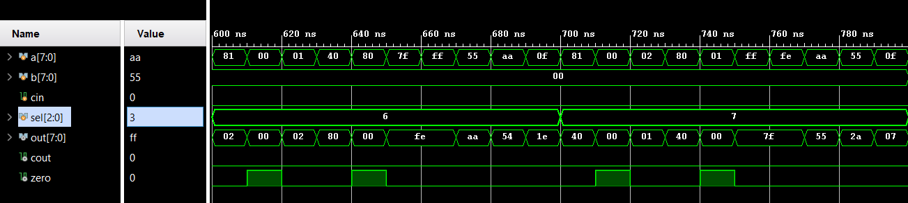

# 8-bit Arithmetic Logic Unit (ALU) using Verilog HDL
 
[]()
[]()
[]()
 
## Overview
 
This project implements an **8-bit Arithmetic Logic Unit (ALU)** in **Verilog HDL**, capable of performing arithmetic, logical, and shift operations selected via a **3-bit opcode (SEL)** signal. The design follows a fully modular approach — each operation (addition, subtraction, AND, OR, XOR, NOT, shift-left, shift-right) is implemented as an independent Verilog module and integrated into a single top-level `alu_top` unit through a combinational output multiplexer.
 
The design was verified using a self-checking testbench covering **80 test vectors (10 per operation)**, synthesized and analyzed for timing and resource utilization in **Xilinx Vivado**.
 
---
 
## Features
 
- 8-bit fully combinational ALU (no clock domain)
- Modular Verilog implementation — one file per operation
- Carry-Out (`COUT`) and Zero (`ZERO`) status flag generation
- Self-checking testbench with automated PASS/FAIL reporting
- 80 test vectors covering typical values, boundary cases, carry/borrow, and zero-result conditions
- RTL schematic, timing, and resource utilization analysis
- Clean synthesis: 0 failing timing endpoints, low LUT footprint
---
 
## Supported Operations
 
| SEL (Opcode) | Operation   | Expression              |
| :----------: | ----------- | ------------------------ |
| `000`        | Addition    | `Result = A + B + Cin`   |
| `001`        | Subtraction | `Result = A - B - Cin`   |
| `010`        | AND         | `Result = A & B`         |
| `011`        | OR          | `Result = A | B`         |
| `100`        | XOR         | `Result = A ^ B`         |
| `101`        | NOT         | `Result = ~A` (B ignored)|
| `110`        | Shift Left  | `Result = A << 1`        |
| `111`        | Shift Right | `Result = A >> 1`        |
 
---
 
## Block Diagram
 
The ALU takes two 8-bit operands (`A`, `B`), a carry-in (`Cin`), and a 3-bit opcode (`SEL`). Each operation module runs in parallel; the output multiplexer selects the correct result based on `SEL`, and the `COUT`/`ZERO` flags are derived accordingly.
 

 
## Project Structure
 
```
8-bit-ALU-Verilog/
|
├── source/
│   ├── adder          # 8-bit adder with carry-in/carry-out
│   ├── sub            # 8-bit subtractor (two's complement)
│   ├── and            # Bitwise AND
│   ├── or             # Bitwise OR
│   ├── xor            # Bitwise XOR
│   ├── not             # Bitwise NOT
│   ├── shifter        # Left/right logical shifter
│   └── alu_top        # Top-level ALU integrating all modules
|
├── testbench           # Self-checking testbench (80 test vectors)
|
├── Result/
│   ├── ALU_Waveform.png              # Overview waveform (1 vector/operation)
│   ├── ALU_Waveform_Extended_1.png   # Extended: ADD, SUB, AND (0-300ns)
│   ├── ALU_Waveform_Extended_2.png   # Extended: OR, XOR, NOT (300-580ns)
│   ├── ALU_Waveform_Extended_3.png   # Extended: SHL, SHR (600-780ns)
│   ├── RTL_Schematic.png             # Post-synthesis RTL schematic
│   ├── Timing_Summary.png            # Design timing summary
│   ├── Utilization_Report.png        # Resource utilization report
│   └── Power_Report.png              # On-chip power analysis
|
└── README.md
```
 
---
 
## Simulation Results
 
### Overview Waveform
 
A single representative test vector per operation, showing all 8 opcodes exercised end-to-end.
 

 
### Extended Verification — 80 Test Vectors (10 per operation)
 
The testbench applies **10 test vectors per operation**, covering typical values, boundary conditions (`0x00`, `0xFF`, `0x80`), carry/borrow triggers, and zero-result cases. All 80 vectors passed automatically via a self-checking PASS/FAIL comparison against pre-computed expected results.
 
**ADD, SUB, AND** (0 - 300 ns)

 
**OR, XOR, NOT** (300 - 580 ns)

 
**Shift Left, Shift Right** (600 - 780 ns)

 
```
TOTAL: 80 passed, 0 failed (out of 80 test vectors)
```
 
---
 
## RTL Schematic
 

 
---
 
## Timing Analysis
 

 
As the ALU is a purely combinational design with no clock domain, no timing constraints were applicable. Post-implementation analysis confirms **zero failing endpoints** across all 10 timing paths, with no setup or hold violations (WNS/WHS = infinite slack).
 
---
 
## Resource Utilization
 

 
| Module | Slice LUTs | F7 Muxes |
| ------ | :--------: | :------: |
| **alu_top (total)** | **54** | **9** |
| Adder  | 4  | 0 |
| Subtractor | 21 | 9 |
 
The complete ALU uses only **54 Slice LUTs** (0.68% of available resources on the target device) and 9 F7 Muxes — a lightweight, efficient implementation. The subtractor is the most resource-intensive submodule, reflecting the additional carry/borrow logic required for two's-complement subtraction. The logical operations (AND, OR, XOR, NOT) and the shifter were optimized and absorbed into the top-level combinational logic by Vivado's synthesizer, owing to their trivial single-gate complexity.
 
---
 
## Power Analysis (Supplementary)
 

 
Total on-chip power is dominated by I/O (89%), consistent with a small combinational design where logic power is minimal (4%). Reported at low confidence, as no vectorless/simulation-based switching activity was supplied — included here for completeness rather than as a primary deliverable.
 
---
 
## Tools & Platform
 
- **Verilog HDL** — design and verification language
- **Xilinx Vivado** — synthesis, implementation, and simulation
- **Git & GitHub** — version control
---
 
## Key Learnings
 
- Designed a fully modular 8-bit ALU in Verilog HDL, with each operation isolated into its own testable unit
- Implemented combinational arithmetic (two's-complement add/subtract), bitwise logic, and shift operations
- Generated and verified Carry-Out and Zero status flags across all operations
- Built a self-checking testbench with automated pass/fail verification, scaling from manual spot-checks to 80 automated vectors
- Interpreted post-synthesis RTL schematics, timing summaries, and resource utilization reports
- Diagnosed and corrected common RTL bugs: operator mismatches, signal width/truncation issues, and improper use of carry signals in purely logical operations
---
 
## Deliverable Checklist
 
- [x] Block diagram with labeled inputs, outputs, and control signals
- [x] Verilog source files — individual operation modules + top-level ALU
- [x] Testbench with 10 test vectors per operation (80 total)
- [x] Simulation waveform screenshots for all 8 operations
- [x] RTL schematic
- [x] Optimization report — LUT count and timing analysis
- [x] Final documentation of design decisions, results, and observations
---
 
## Future Scope
 
This ALU serves as the arithmetic/logic core for the **Major Project: RISC Processor Design** — a simplified single-cycle RISC processor integrating this ALU with a register file, program counter, instruction memory, and control unit.
 
Planned extensions:
- RISC-V-inspired instruction set architecture (ISA)
- Full datapath: Fetch -> Decode -> Execute -> Memory -> Write-back
- Optional 2-stage pipeline enhancement


---
